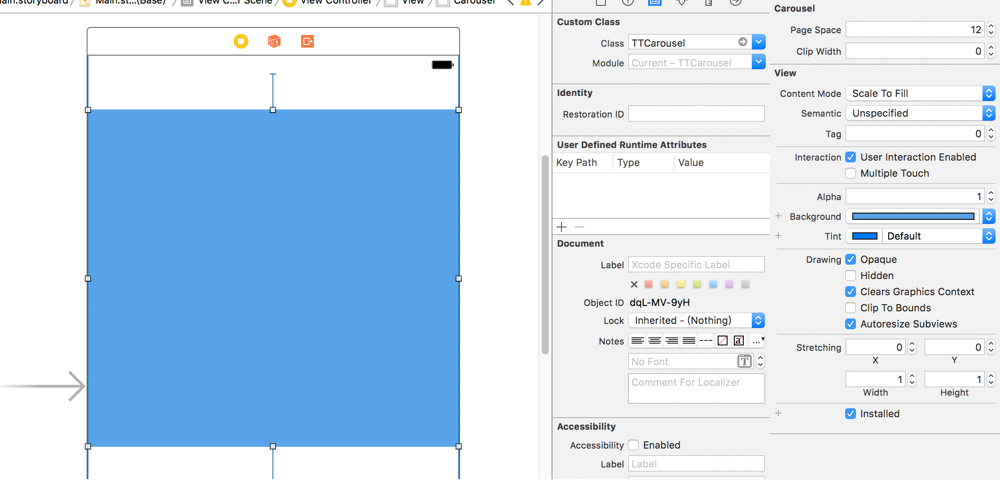
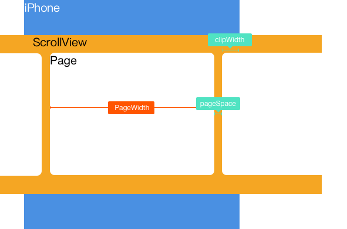

## TTCarousel


### Demo


### Usage

1. Create the view in stroyboard

   

2. Then implement the dataSource of carousel (like UITableViewDataSource)

   ```swift
   func numberOfPages(_ carouse: TTCarousel) -> Int {
       return 3
     }
     
   func pageTitle(currentIndex: Int) -> String {
     return titles[currentIndex]
   }

   func pageView(_ carouse: TTCarousel, pageSize: CGSize, pageIndex: Int) -> UIView {
     let view = UIView()
     let image = UIImageView(image: UIImage(named: "img1"))
     image.contentMode = .scaleAspectFill
     image.frame = CGRect(x: 0, y: 0, width: pageSize.width, height: pageSize.height)
     image.layer.cornerRadius = 5
     image.clipsToBounds = true

     view.addSubview(image)
     return view
   }
   ```

3. And see the result

### Configuration

Widget Structure



So you can change th `clipWidth` and `pageSpace` to change the behavior of the carousel. If the clipWidth and pageSpace is confirmed the pageWidth is also confirmed.